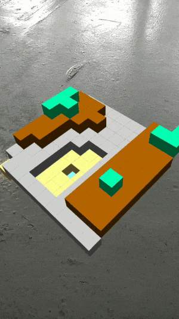

# procedural-ar
Using [Simplex noise](https://www.npmjs.com/package/simplex-noise) to  generate a map in Spark AR procedurally.

## Usage

[Webpack](https://webpack.js.org/) is used to bundle all the code together. To make any changes you can run either of the commands below.

### Development
- run `npm run dev`
- this will watch your files for changes and automatically build the code
- when the code is rebuilt, Spark AR should refresh on code change

### Production
- run `npm run build`
- this just runs the build once and outputs a minified file